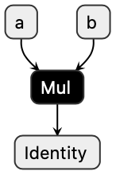

# Introduction to RedisAI

## What is RedisAI?
RedisAI is a Redis module for executing Deep Learning/Machine Learning models and managing their data. Its purpose is being a "workhorse" for model serving, by providing out-of-the-box support for popular DL/ML frameworks and unparalleled performance. RedisAI both simplifies the deployment and serving of graphs by leveraging on Redis' production-proven infrastructure, as well as maximizes computation throughput by adhering to the principle of data locality.

This introduction is intended to present the core concepts it uses and the functionality it provides.

!!! important "Prerequisites"
    Before diving into RedisAI please make sure that you are familiar with the basic concepts of machine learning and Redis.

This video will introduce you to RedisAI at a high level. Give it a watch, then keep reading for more details.

<iframe width="560" height="315" src="https://www.youtube.com/embed/gbiqF-eyTW4" frameborder="0" allow="accelerometer; autoplay; clipboard-write; encrypted-media; gyroscope; picture-in-picture" allowfullscreen></iframe>

In broad strokes, RedisAI's looks as follows:

```
+-----------------------------------------------------------------------------+
| SERVER                                                                      |
| +-------------------------------------------------------------------------+ |
| | REDIS                              +----------+                         | |
| | +----------+   +-----------------+ | Commands | +---------------------+ | |
| | | KEYSPACE |   |  REDISAI          +----+-----+                       | | |
| | |          |   |                        ^                             | | |
| | +----------+   |  Data Structures       |             DL/ML Backends  | | |
| | |          |   |  +--------+            |             +-------------+ | | |
| | | mytensor +----->+ Tensor +<--+        |         +-->+ TensorFlow  | | | |
| | |          |   |  +--------+   |        |         |   +-------------+ | | |
| | +----------+   |               |        |         |                 | | | |
| | |          |   |  +--------+   |        v         |   +-------------+ | | |
| | | mymodel  +----->+ Model  +---+   +----+-----+   +-->+   PyTorch   | | | |
| | |          |   |  +--------+   |   |          |   |   +-------------+ | | |
| | +----------+   |               +-->+  Engine  +<--+                   | | |
| | |          |   |  +--------+   |   |          |   |   +-------------+ | | |
| | | myscript +----->+ Script +---+   +----+-----+   +-->+ ONNXRuntime | | | |
| | |          |   |  +--------+   |        ^         |   +-------------+ | | |
| | +----------+   |               |        |         |                   | | |
| |              ^ |  +--------+   |        |         |   +-------------+ | | |
| |              | |  +  DAG   +---+        |         +-->+     ...     | | | |
| |              | |  +--------+            |             +-------------+ | | |
| |              | +------------------------|-----------------------------+ | |
| +--------------|--------------------------|-------------------------------+ |
|                v                          v                                 |
| +--------------+-----------------+   +------------------------------------+ |
| | RAM                            |   | DEVICES                            | |
| |                                |   | +-----+  +-----+  +-----+  +-----+ | |
| | 00101010 00101010 00101010 ... |   | | CPU |  | GPU |  | TPU |  | ... | | |
| |                                |   | +-----+  +-----+  +-----+  +-----+ | |
| +--------------------------------+   +------------------------------------+ |
+-----------------------------------------------------------------------------+
```

### What is Redis?
**Redis** is an ...

!!! quote "https://redis.io"
    ... open source (BSD licensed), in-memory data structure store, used as a database, cache and message broker. It supports data structures such as strings, hashes, lists, sets, sorted sets with range queries, bitmaps, hyperloglogs, geospatial indexes with radius queries and streams. Redis has built-in replication, Lua scripting, LRU eviction, transactions and different levels of on-disk persistence, and provides high availability via Redis Sentinel and automatic partitioning with Redis Cluster.

!!! tip "Redis is also..."
    An acronym for **RE**mote **DI**ctionary **S**erver that's pronounced "red" like the color, then "iss".

??? info "Further reference"
    More about Redis:

      * [Home page](https://redis.io)
      * [Interactive tutorial](http://try.redis.io)
      * [Repository](https://github.com/antirez/redis)

Basically, Redis is many things, but one of the things it is best known for is being a _Key-Value_ server. That means that the data in Redis is represented as keys - unique string identifiers - and their respective values.

For example, this shows the basic use of the native [Redis String data structure](https://redis.io/topics/data-types-intro#redis-strings) using the [`SET`](https://redis.io/commands/set) and [`GET`](https://redis.io/commands/get) commands:

```
redis> SET mykey somevalue
OK
redis> GET mykey
"somevalue"
```

### What is a Redis Module?
A **Redis module** is a shared library that can be loaded by the Redis server during runtime. Modules are useful for extending Redis with new data structures and logic. A Redis module leverages the server's infrastructure. RedisAI is implemented as a module, which allows it direct access to the data managed by the server.

??? info "Further reference"
    You can learn more about Redis modules at:

      * [Redis Modules API](https://redis.io/documentation#redis-modules-api)
      * [Modules published at redis.io](https://redis.io/modules)

### Why RedisAI?
RedisAI bundles together best-of-breed technologies for delivering stable and performant computation graph serving. Every DL/ML framework ships with a runtime for executing the models developed with it, and the common practice for serving these is building a simple server around them.

RedisAI aims to be that server, saving you from the need of installing the backend you're using and developing a server for it. By itself that does not justify RedisAI's existence so there's more to it. Because RedisAI is implemented as a Redis module it automatically benefits from the server's capabilities: be it Redis' native data types, its robust eco-system of clients, high-availability, persistence, clustering, and Enterprise support.

Because Redis is an in-memory data structure server RedisAI uses it for storing all of its data. The main data type supported by RedisAI is the Tensor that is the standard representation of data in the DL/ML domain. Because tensors are stored in the memory space of the Redis server, they are readily accessible to any of RedisAI's backend libraries at minimal latency.

The locality of data, which is tensor data in adjacency to DL/ML models backends, allows RedisAI to provide optimal performance when serving models. It also makes it a perfect choice for deploying DL/ML models in production and allowing them to be used by any application.

Furthermore, RedisAI is also an optimal testbed for models as it allows the parallel execution of multiple computation graphs and, in future versions, assessing their respective performance in real-time.

#### Data Structures
RedisAI provides the following data structures:

* **Tensor**: represents an n-dimensional array of values
* **Model**: represents a computation graph by one of the supported DL/ML framework backends
* **Script**: represents a [TorchScript](https://pytorch.org/docs/stable/jit.html) program

#### DL/ML Backends
RedisAI supports the following DL/ML identifiers and respective backend libraries:

* **TF**: the TensorFlow backend
* **TFLITE**: The TensorFlow Lite backend
* **TORCH**: The PyTorch backend
* **ONNX**: ONNXRuntime backend

Backend libraries are dynamically loaded as needed, but can also be loaded during booting or at runtime.

??? info "Further reference"
    Refer to these pages for more information on loading backends:

    * [`AI.CONFIG` command](commands.md#aiconfig)
    * [Backend configuration](configuration.md#backend)

## Getting Started
The easiest way to get a standalone Redis server with RedisAI bootstrapped locally is to use the official RedisAI Docker container image:

```
docker run -d --name redisai -p 6379:6379 redislabs/redisai:latest
```

??? info "Further reference"
    For more information on installing RedisAI refer to the [Quickstart page](quickstart.md).

Once the server is up, you can connect to it using any [Redis client](https://redis.io/clients). Better yet, some languages already have client implementations for RedisAI - the list can be found at the [Clients page](clients.md). RedisAI clients wrap the core API and simplify the interaction with the module.

We'll begin by using the official [`redis-cli`](https://redis.io/topics/rediscli) Redis client. If you have it locally installed feel free to use that, but it is also available from the container:

```
docker exec -it redisai redis-cli
```

## Using RedisAI Tensors
A **Tensor** is an n-dimensional array and is the standard representation for data in DL/ML workloads. RedisAI adds to Redis a Tensor data structure that implements the tensor type. Like any datum in Redis, RedisAI's Tensors are identified by key names.

Creating new RedisAI tensors is done with the [`AI.TENSORSET` command](commands.md#aitensorset). For example, consider the tensor: $\begin{equation*} tA = \begin{bmatrix} 2 \\ 3 \end{bmatrix} \end{equation*}$.

We can create the RedisAI Tensor with the key name 'tA' with the following command:

```
AI.TENSORSET tA FLOAT 2 VALUES 2 3
```

Copy the command to your cli and hit the `<ENTER>` on your keyboard to execute it. It should look as follows:

!!! example "Example: setting a tensor"
    ```
    $ docker exec -it redisgears redis-cli
    127.0.0.1:6379> AI.TENSORSET tA FLOAT 2 VALUES 2 3
    OK
    ```

The reply 'OK' means that the operation was successful. We've called the `AI.TENSORSET` command to set the key named 'tA' with the tensor's data, but the name could have been any string value. The `FLOAT` argument specifies the type of values that the tensor stores, and in this case a single-precision floating-point. After the type argument comes the tensor's shape as a list of its dimensions, or just a single dimension of 2.

The `VALUES` argument tells RedisAI that the tensor's data will be given as a sequence of numeric values and in this case the numbers 2 and 3. This is useful for development purposes and creating small tensors, however for practical purposes the `AI.TENSORSET` command also supports importing data in binary format.

The Redis key 'tA' now stores a RedisAI Tensor. We can verify that using standard Redis commands such as [`EXISTS`](https://redis.io/commands/exists) and [`TYPE`](https://redis.io/commands/type):

!!! example "Example: tensor key existence and type"

    ```
    127.0.0.1:6379> EXISTS tA
    (integer) 1
    127.0.0.1:6379> TYPE tA
    AI_TENSOR
    ```

Using `AI.TENSORSET` with the same key name, as long as it already stores a RedisAI Tensor, will overwrite the existing data with the new. To delete a RedisAI tensor, use the [Redis `DEL` command](https://redis.io/commands/del).

RedisAI Tensors are used as inputs and outputs in the execution of models and scripts. For reading the data from a RedisAI Tensor value there is the [`AI.TENSORGET` command](commands.md#aitensorget):

!!! example "Example: getting a tensor key"

    ```
    127.0.0.1:6379> AI.TENSORGET tA META VALUES
    1) dtype
    2) INT8
    3) shape
    4) 1) (integer) 2
    5) values
    6) 1) (integer) 2
       1) (integer) 3
    ```

## Loading Models
A **Model** is a Deep Learning or Machine Learning frozen graph that was generated by some framework. The RedisAI Model data structure represents a DL/ML model that is stored in the database and can be run.

Models, like any other Redis and RedisAI data structures, are identified by keys. A Model's key is created using the [`AI.MODELSET` command](commands.md#aimodelset) and requires the graph payload serialized as protobuf for input.

In our examples, we'll use one of the graphs that RedisAI uses in its tests, namely 'graph.pb', which can be downloaded from [here](https://github.com/RedisAI/RedisAI/raw/master/tests/test_data/graph.pb). This graph was created using TensorFlow with [this script](https://github.com/RedisAI/RedisAI/blob/master/tests/test_data/tf-minimal.py).

??? info "Downloading 'graph.pb'"
    Use a web browser or the command line to download 'graph.pb':

    ```
    wget https://github.com/RedisAI/RedisAI/raw/master/tests/test_data/graph.pb
    ```

You can view the computation graph using [Netron](https://lutzroeder.github.io/netron/), which supports all frameworks supported by RedisAI.



This is a great way to inspect a graph and find out node names for inputs and outputs.

redis-cli doesn't provide a way to read files' contents, so to load the model with it we'll use the command line and output pipes:

```
cat graph.pb | docker exec -i redisai redis-cli -x \
               AI.MODELSET mymodel TF CPU INPUTS a b OUTPUTS c BLOB
```

??? example "Example: loading a model from command line"
    ```
    $ cat graph.pb | docker exec -i redisai redis-cli -x \
               AI.MODELSET mymodel TF CPU INPUTS a b OUTPUTS c BLOB
    OK
    ```

!!! important "Use a client in your language of choice"
    For practical purposes, you are encouraged to use a programmatic Redis or RedisAI client in the language of your choice for interacting with RedisAI. Refer to the following pages for further information:

    * [Redis clients page](https://redis.io/clients)
    * [RedisAI clients page](clients.md)

Like most commands, `AI.MODELSET`'s first argument is a key's name, which is 'mymodel' in the example. The next two arguments are the model's DL/ML backend and the device it will be executed on. 'graph.pb' in the example is a TensorFlow graph and is denoted by `TF` argument. The model will be executed on the CPU as instructed by the `CPU` argument.

TensorFlow models also require declaring the names of their inputs and outputs. The inputs for 'graph.pb' are called 'a' and 'b', whereas its single output is called 'c'. These names are provided as additional arguments after the 'INPUTS' and 'OUTPUTS' arguments, respectively.

## Running Models
Once a RedisAI Model key has been set with `AI.MODELSET` it can be run with any Tensor keys from the database as its input. The model's output, after it was executed, is stored in RedisAI Tensors as well.

The model stored at 'mymodel' expects two input tensors so we'll use the previously-create 'tA' and create another input tensor, $\begin{equation*} tB = \begin{bmatrix} 3 \\ 5 \end{bmatrix} \end{equation*}$, with the following command:

```
AI.TENSORSET tB FLOAT 2 VALUES 3 5
```

The model can now be run with the [`AI.MODELRUN` command](commands.md#aimodelrun) as follows:

```
AI.MODELRUN mymodel INPUTS tA tB OUTPUTS tResult
```

!!! example "Example: running a model"

    ```
    127.0.0.1:6379> AI.TENSORSET tA FLOAT 2 VALUES 2 3
    OK
    127.0.0.1:6379> AI.TENSORSET tB FLOAT 2 VALUES 3 5
    OK
    127.0.0.1:6379> AI.MODELRUN mymodel INPUTS tA tB OUTPUTS tModel
    OK
    ```

The first argument to `AI.MODELRUN` is the name of the key at which the RedisAI Model is stored. The names of RedisAI Tensor keys that follow the `INPUTS` argument are used as input for the model. Similarly, following the `OUTPUT` argument are the key names of RedisAI Tensors that the model outputs.

The inputs for the example are the tensors stored under the 'tA' and 'tB' keys. Once the model's run had finished, a new RedisAI Tensor key called 'tResult' is created and stores the model's output.

!!! example "Example: fetching the model's output"

    ```
    127.0.0.1:6379> AI.TENSORGET tModel VALUES
    1) FLOAT
    2) 1) (integer) 2
    3) 1) "6"
       2) "15"
    ```

The model we've imported from 'graph.pb' takes two input tensors as input and outputs a tensor that is the product of multiplying them. In the case of the example above it looks like this:

$$
\begin
{equation*} tModel = tA \times tB =
\begin{bmatrix}
2 \\ 3
\end{bmatrix}
\times
\begin{bmatrix}
3 \\ 5
\end{bmatrix}
 =
\begin{bmatrix}
2 \times 3  \\ 3 \times 5
\end{bmatrix}
 =
\begin{bmatrix}
6  \\ 15
\end{bmatrix}
\end
{equation*}
$$

## Model Management
The [`AI.MODELGET` command](commands.md#aimodelget) can be used for retrieving information about a model and its serialized blob. The [`AI.INFO` command](commands.md#aiinfo) shows runtime statistics about the model's runs. Lastly, RedisAI Model keys can be deleted with the [`AI.MODELDEL` command](commands.md#aimodeldel).

## Scripting
RedisAI makes it possible to run [TorchScript](https://pytorch.org/docs/stable/jit.html) with the PyTorch backend. Scripts are useful for performing pre- and post-processing operations on tensors.

The RedisAI Script data structure is managed via a set of dedicated commands, similarly to the models. A RedisAI Script key is:

* Created with the [`AI.SCRIPTSET` command](commands.md#aiscriptset)
* Run with the [`AI.SCRIPTRUN` command](commands.md#aiscriptrun)
* Deleted with the [`AI.SCRIPTDEL` command](commands.md#aiscriptdel)

We can create a RedisAI Script that performs the same computation as the 'graph.pb' model. The script can look like this:

```py
def multiply(a, b):
    return a * b
```

Assuming that the script is stored in the 'myscript.py' file it can be uploaded via command line and the `AI.SCRIPTSET` command as follows:

```
cat myscript.py | docker exec -i redisai redis-cli -x AI.SCRIPTSET myscript CPU SOURCE
```

This will store the PyTorch Script from 'myscript.py' under the 'myscript' key and will associate it with the CPU device for execution. Once loaded, the script can be run with the following:

```
AI.SCRIPTRUN myscript multiply INPUTS tA tB OUTPUTS tScript
```

!!! example "Example: running a script"

    ```
    127.0.0.1:6379> AI.TENSORSET tA FLOAT 2 VALUES 2 3
    OK
    127.0.0.1:6379> AI.TENSORSET tB FLOAT 2 VALUES 3 5
    OK
    127.0.0.1:6379> AI.SCRIPTRUN myscript multiply INPUTS tA tB OUTPUTS tScript
    OK
    127.0.0.1:6379> AI.TENSORGET tScript VALUES
    1) FLOAT
    2) 1) (integer) 2
    3) 1) "6"
       2) "15"
    ```

## Where Next?
This covers the basics of RedisAI's data structures and capabilities. For more information refer to:

* The [Commands page](commands.md) provides a reference of the RedisAI API
* The [Clients page](clients.md) lists RedisAI clients in several programming languages
* The [Examples page](examples.md) showcases several examples that can be extended
