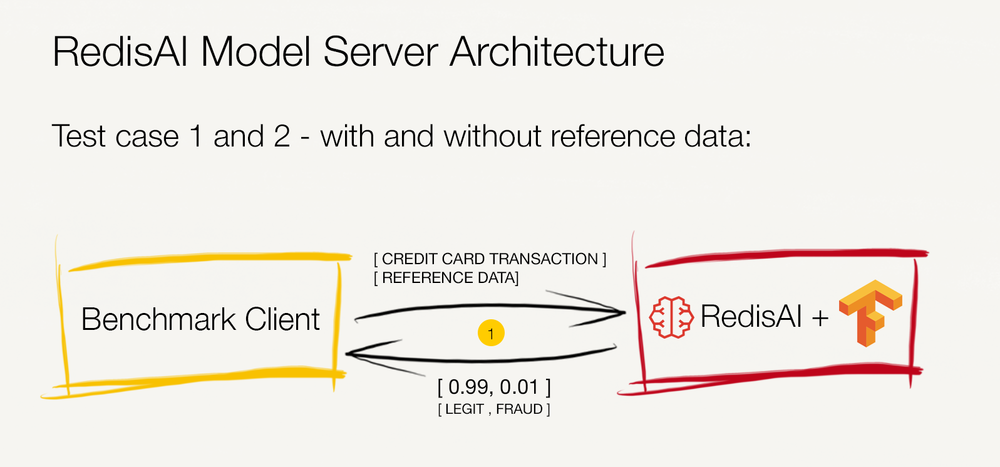
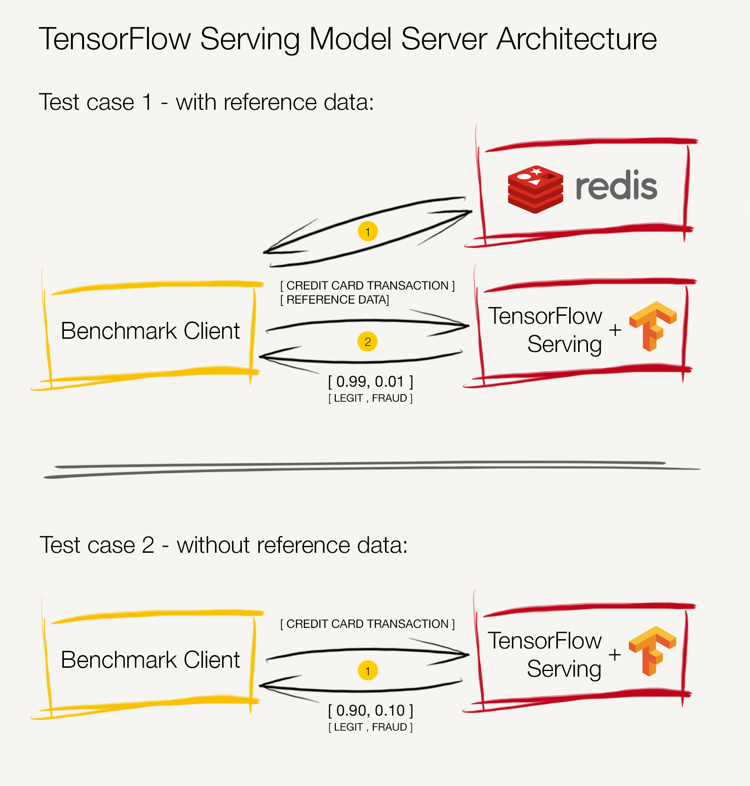
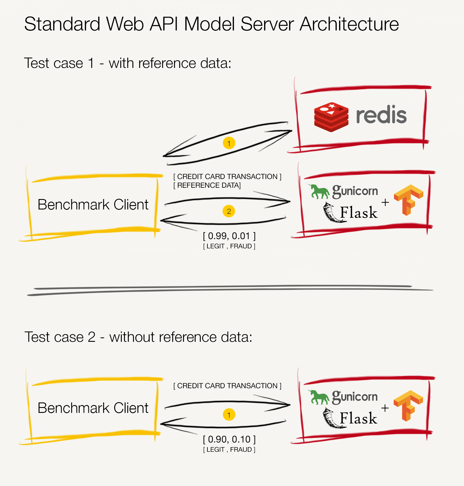

# Performance

To get an early sense of what RedisAI is capable of, you can test it with [`redis-benchmark`](https://redis.io/topics/benchmarks) or [`memtier_benchmark`](https://github.com/RedisLabs/memtier_benchmark) just like
any other Redis command. However, in order to have more control over the tests, we'll use a 
a tool written in Go called [_AIBench_](https://github.com/RedisAI/aibench). 

This page is intended to provide clarity on how to obtain the benchmark numbers, and links to the most recent results. We encourage developers, data scientists, and architects to run these benchmarks for themselves on their particular hardware,datasets, and Model Servers and pull request this documentation with links for the actual numbers.


## Inside the benchmark suite

_AIBench_ is a collection of Go programs that are used to generate datasets and then benchmark inference performance of various Model Servers. The intent is to make the AIBench extensible so that a variety of use cases, and Model Servers can be included and benchmarked. 
Bellow, are the current DL solutions supported:

- RedisAI
- TFServing + Redis
- Rest API + Redis


### Transaction data dataset characteristics

Currently, aibench supports one use case -- creditcard-fraud from [Kaggle](https://www.kaggle.com/mlg-ulb/creditcardfraud) with the extension of reference data. This use-case aims to detect a fraudulent transaction based on anonymize credit card transactions and reference data.


We've decided to extend the initial dataset in the sense that for each Transaction data, we generate random deterministic Reference data, commonly used to enrich financial transactions information. In the financial service industry and regulatory agencies, the reference data that defines and describes such financial transactions, can cover all relevant particulars for highly complex transactions with multiple dependencies, entities, and contingencies, thus resulting in a larger numerical value input tensor of size 1 x 256.

Following the previously described, the predictive model to be developed is a neural network implemented in tensorflow with input tensors containing both transaction (1 x 30 tensor) and reference data (1 x 256 tensor) and with a single output tensor (1 x 2 tensor), presenting the fraudulent and genuine probabilities of each financial transaction.

### Understanding the benchmark phases

Benchmarking inference performance has four phases: 

 - **Model setup**: This step is specific for each DL solution being tested (see the benchmark GitHub repo for detailed deployment info for each supported DL solution).

 - **Transaction data parsing and reference data generation**: To keep benchmarking results from being affected by generating data on the fly, the proposed benchmark suite can generate the data required for the inference benchmarks first, and we can then use it as input to the benchmarking and reference data-loading phases. All inference benchmarks use the same dataset, together with random deterministic reference data if using the same random seed.

 - **Reference data loading**: The reference data that defines and describes the financial transactions already resides on a datastore common to all benchmarks. We use Redis as the primary datastore for the inference benchmarks.

 - **Inference query execution**: This phase looks at the achievable inference throughput of each Model Serving solution and performs a full percentile inference latency analysis. Model serving with and without reference data is supported across all solution to enable a deeper insight on the overall weight of the reference data and the extra network hop to fetch it.
 

### Inference query execution diagrams per Model Serving Solution

The sequence of requests that each solution executes is described thoughtfully in the benchmark client GitHub diagrams, [here](https://github.com/RedisAI/aibench/blob/master/docs/redisai.md), [here](https://github.com/RedisAI/aibench/blob/master/docs/redisai.md), and [here](https://github.com/RedisAI/aibench/blob/master/docs/restapi_and_redis.md#aibench-supplemental-guide-dl-rest-api-and-redis).
  
Bellow you can find a simplified version of the diagrams, including both tests cases ( with and without reference data).


#### RedisAI




#### TFServing + Redis



#### Rest API + Redis




### Model Serving optimizations

We follow best practices for high-performance Model Serving for each Model Server’s configuration, its protocol layer, and the most efficient serialization method. For protocols to serve models for inference, we leveraged gRPC for Google’s TensorFlow serving, HTTP for standard web APIs, and RESP2 for RedisAI. 

Across all Model Servers, we recommend retaining batching to its default value of false, meaning that each Model Server processes one inference at a time per available executor, so we can track the raw performance of the servers.

Some Model Servers have components that are lazily initialized, which can increase latency for the first requests sent to a model after it is loaded. To reduce this “cold-start” effect on overall performance, you should add burn-in full-inference cycles that are not taken into account by the benchmark, .

Specifically for TensorFlow serving we’ve achieved a better configuration that enabled for higher inference throughput by setting the inter_op_parallelism_threads option to 4 (enabling us to parallelize operations that have sub-operations that are inherently independent up to a degree of 4 concurrent sub-operations). We improved TensorFlow serving intra_op_parallelism_threads results by allowing the tool to adjust with the default behaviour. 

For RedisAI, we maximized inference throughput by limiting the inter-op and intra-op parallelism to 1 per shard, meaning that each added redis standalone instance/shard has an associated backend thread, in a shared-nothing architecture - a strategy that allows to maximize the hardware usage, and maintain a linear scalability both on vertical and horizontal flavours.

For the standard web API Model Server, setting Gunicorn worker processes number to 24 for handling concurrent requests resulted in the highest inference throughput.

### How to install aibench

The easiest way to get and install the aibench Go programs is to use
`go get` and then `go install`:

```bash
# Fetch aibench and its dependencies
go get github.com/RedisAI/aibench/...

# Install desired binaries. At a minimum this includes aibench_load_data, and one aibench_run_inference_*
# binary:
cd $GOPATH/src/github.com/RedisAI/aibench/cmd
cd aibench_generate_data && go install
cd ../aibench_load_data && go install
cd ../aibench_run_inference_redisai && go install
cd ../aibench_run_inference_tensorflow_serving && go install
cd ../aibench_run_inference_flask_tensorflow && go install
```


### Methodology and Infrastructure checklist

As stated previously we encourage the community to to run and request for PR with regards to showcasing the obtained results for any Model Server. With regards to the results methodology we expected that for each tested version/variation:

- A minimum of 3 distinct full repetitions, and reported as a result the median (q50), q95, q99, overall achievable inference throughput, and if possible ( and recommended ) the referral to the full spectrum of latencies.
- A full platform description. Ideally you should run the the benchmark and Model Serving instances in separate machines, placed in an optimal networking scenario. 
- Considering the weight of the network performance in the overall performance of the Model Serving solution we recommend that in addition to the aibench performance runs described above, to also run baseline netperf TCP_RR, in order to understand the underlying network characteristics. 


### What the benchmark suite does not account for

As important as understanding the metrics and takeaways that this benchmark provides is to understand what is considered out of scope. This benchmark suite was not designed to test some key aspects of observability, operational and model-lifecycle management, fault tolerance, and high availability of the Model Server. **As important as performance**, these factors should be part of a prudent decision on which solution to adopt, and we hope to provide further guidance on them in other sections of the documentation. 

### Latest benchmark results


